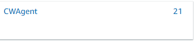
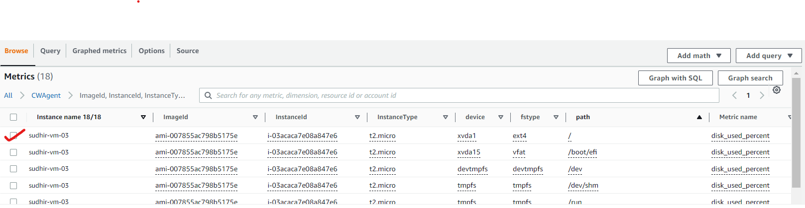

# 1. Create SNS Topic

**REASON** - we alarm will trigger, it will send message to SNS Topic

**Manual Creation**

* Name - sudhir-vm-sns
* select, Type - Standard
* select, Protocol - Email
  * enter email address "ssrrdd007@gmail.com" in "Endpoint"

# 2. Create and Configure Alarm

**REASON** - By using this alarm we can perform some actions when storage utilization crosses 80% threshold. Cloud Watch agent keep sending metrics to cloud watch. Here, we will set an alarm, which will trigger after crossing of 80% storage utilization.

**Manual Creation**

* Name - sudhir-vm-alarm

* In metrics section, there is an option like below

  

* This option was not available before, but now is available, because we have installed cloud watch agent into EC2 instance.

  * **WARNING** - Do not forgot to change the region to EC2's region 

* By clicking on it, we can see various metrics

* select metric as below

  

* Under Conditions
  * select Greater than 80%
  
* Under Notification
  * select SNS as "sudhir-vm-sns"
