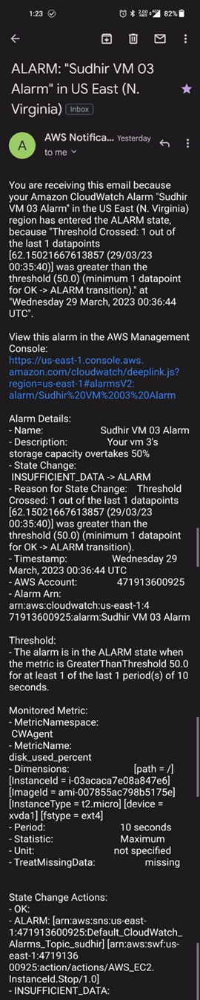

# 1. Fill random data to EC2 to cross 80% threshold

**REASON** - Manual filling will take time, so we can use linux command to fill random data.

* execute following command

  ```python
  dd if=/dev/urandom of=/tmp/fillup bs=1M count=4000
  ```

  * This command will create a 4 GB file named /tmp/fillup filled with random data in 1 MB blocks. The count parameter specifies the number of blocks to write, and since 1 GB is equal to 1000 MB, we set the count parameter to 4000.

# 2. Screenshots

## Email




## Increased SSD Storage in EC2 instance

Go to EC2 instance, and you will see SSD storage increased to 12 GB